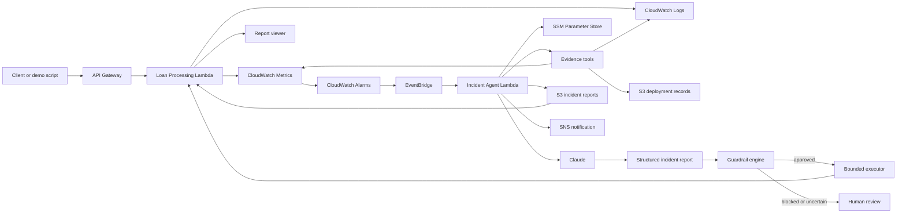

# AI Incident Triage Agent

An AWS-based incident investigation workflow for a sample loan-processing service.

The project detects application failures, collects evidence from CloudWatch and S3, uses Claude to produce a structured diagnosis, applies deterministic guardrails, and stores the result as an incident report.

The model recommends actions. Application policy and AWS IAM decide whether an action can run.

## What it demonstrates

- Serverless application and incident agent on AWS Lambda
- CloudWatch logs, metrics, and alarms
- EventBridge-driven incident invocation
- Claude tool use for evidence collection
- Deterministic guardrails outside the model
- Bounded remediation with least-privilege IAM
- JSON and Markdown incident reports in S3
- Terraform infrastructure and GitHub Actions CI/CD

## Architecture



### Runtime flow

1. API Gateway sends requests to the Loan Processing Lambda.
2. The application writes structured logs and CloudWatch Embedded Metric Format data.
3. Error or latency alarms enter the `ALARM` state when a threshold is crossed.
4. EventBridge invokes the Incident Agent Lambda.
5. Claude can request three controlled tools:
   - recent CloudWatch logs
   - CloudWatch metrics and alarm state
   - recent deployment records from S3
6. The agent converts the result into a validated `IncidentReport`.
7. The guardrail engine evaluates the recommended action.
8. Approved actions use predefined executors; risky or uncertain actions require human review.
9. Every result is stored in S3 as JSON and Markdown.

The live demo invokes the same agent Lambda directly after failure injection so it does not wait for the CloudWatch alarm evaluation period.

## Repository layout

```text
apps/loan-processing/
  src/                  Loan API, failure injection, metrics, report viewer
  tests/                Application tests

agent/
  src/                  Agent, tools, guardrails, reporting
  tests/                Agent and guardrail tests

infra/                  Terraform resources and environment values
scripts/                Packaging, verification, and demo scripts
.github/workflows/       CI and dev deployment
```

## Guardrails

The guardrail engine is separate from the Claude prompt and tool loop. It uses an explicit action catalog, confidence thresholds, blocked patterns, and predefined executors.

| Action | Autonomous behavior |
|---|---|
| `restart_service` | Allowed when confidence is at least 90 |
| `scale_service` | Allowed when confidence is at least 90 and capped at a configured ceiling |
| `no_action` | Records the result without changing the service |
| `page_human` | Publishes a notification for follow-up |
| `rollback_deploy` | Requires human approval |
| `investigate_database` | Requires human approval |
| Unknown or destructive action | Blocked |

Blocked patterns include delete, destroy, terminate, IAM mutation, wipe, and purge operations.

The restart executor updates a `RESTART_TOKEN` environment variable on the Loan Processing Lambda. This causes AWS to replace Lambda execution environments and provides a visible before-and-after value. It is intentionally narrower than deploying new code or changing infrastructure.

## Demo scenarios

The repository includes three repeatable scenarios:

### 1. Recovered transient

- Calls `/chaos/false_alarm`
- Writes a transient warning followed by successful processing
- Expected recommendation: `no_action`

This endpoint returns HTTP 200 and does not emit the `LoanErrors` metric. The demo script invokes the agent manually to test investigation behavior.

### 2. Connection-pool exhaustion

- Calls `/simulate-error`
- Produces an HTTP 500 and realistic connection-pool evidence
- Expected recommendation: `restart_service`
- Expected result: guardrail approval and a changed `RESTART_TOKEN`

The database symptoms are simulated in application code; the project does not provision a database.

### 3. Destructive recommendation

- Supplies a synthetic `delete_database` recommendation at 99 percent confidence
- Expected result: blocked, human review required, no execution

This is a deterministic adversarial guardrail test, not a live Claude recommendation.

Scenarios one and two perform the real Claude tool investigation, then stabilize the final action and minimum confidence to keep the timed demo repeatable. The normal EventBridge path does not apply demo stabilization.

## Prerequisites

- Python 3.11 or later
- PowerShell for the included Windows scripts
- AWS CLI authenticated to the target account
- Terraform 1.5 or later for infrastructure work
- An Anthropic API key for live agent investigation

## Local development

Install the project and development dependencies:

```powershell
python -m pip install --upgrade pip
python -m pip install -e ".[dev]"
python -m pip install -r agent/requirements.txt
```

Run the test suite:

```powershell
python -m pytest
```

Run only the guardrail tests:

```powershell
python -m pytest agent/tests/test_guardrails.py -v
```

Run Ruff:

```powershell
python -m ruff check agent/src apps/loan-processing/src
```

## Deployment

The recommended deployment path is the `Deploy Dev` GitHub Actions workflow.

### 1. Configure AWS credentials in GitHub

In the repository, open:

`Settings → Secrets and variables → Actions`

Use one of the following:

- `AWS_ROLE_TO_ASSUME` for GitHub OIDC, or
- `AWS_ACCESS_KEY_ID` and `AWS_SECRET_ACCESS_KEY`

OIDC is preferred because it avoids long-lived access keys.

### 2. Push a relevant change or run the workflow manually

The deployment workflow runs when changes under `apps/`, `agent/`, `infra/`, or `scripts/` are pushed to `main` or `master`. It can also be started with `workflow_dispatch`.

The workflow:

1. packages both Lambda functions
2. configures and verifies AWS credentials
3. creates or reuses the versioned Terraform state bucket
4. initializes the S3 backend
5. adopts existing resources when needed
6. runs `terraform apply`
7. writes a deployment marker to S3

### 3. Store the Anthropic key in SSM

Do not commit the key or add it to the README.

```powershell
aws ssm put-parameter `
  --name "/ai-incident-triage-agent/dev/anthropic_api_key" `
  --value "YOUR_ANTHROPIC_API_KEY" `
  --type SecureString `
  --overwrite `
  --region us-east-1
```

Verify the parameter metadata without printing the value:

```powershell
aws ssm get-parameter `
  --name "/ai-incident-triage-agent/dev/anthropic_api_key" `
  --region us-east-1 `
  --query "Parameter.{Name:Name,Type:Type,Version:Version}"
```

## Running the demo

The demo script discovers the deployed API and resource names with the AWS CLI. Local Terraform initialization is not required.

```powershell
cd C:\Users\manis\Projects\ai-incident-triage-agent
```

Check the API:

```powershell
$api = aws apigatewayv2 get-apis `
  --region us-east-1 `
  --query "Items[?Name=='ai-incident-triage-agent-dev-http'].ApiEndpoint | [-1]" `
  --output text

Invoke-RestMethod "$api/health"
```

Run one scenario:

```powershell
powershell -ExecutionPolicy Bypass -File .\scripts\demo_three_scenarios.ps1 -Scenario 1
powershell -ExecutionPolicy Bypass -File .\scripts\demo_three_scenarios.ps1 -Scenario 2
powershell -ExecutionPolicy Bypass -File .\scripts\demo_three_scenarios.ps1 -Scenario 3
```

Run all scenarios:

```powershell
powershell -ExecutionPolicy Bypass -File .\scripts\demo_three_scenarios.ps1
```

Open the report viewer:

```powershell
Start-Process "$api/reports"
```

Click **Refresh** after a scenario completes. The newest report appears first.

## Reports

Each investigation writes:

```text
incidents/<UTC timestamp>-<random suffix>.json
incidents/<UTC timestamp>-<random suffix>.md
```

The JSON object contains:

- incident ID
- structured incident report
- guardrail decision
- alarm and demo context

The Markdown object is a human-readable summary. The S3 bucket is private, public access is blocked, and the current lifecycle expires artifacts after 30 days.

The report viewer reads the JSON objects through the Loan Processing Lambda. S3 remains the source of truth.

## CI/CD

### CI workflow

Runs on pull requests and pushes to `main` or `master`:

- Python 3.12 dependency installation
- Ruff reporting
- pytest
- Terraform formatting and validation

Ruff is currently informational because the workflow uses `|| true`. pytest and Terraform checks are blocking.

### Deploy Dev workflow

Runs manually or when relevant paths change:

- Lambda packaging
- AWS credential verification
- Terraform remote-state initialization
- Terraform apply
- S3 deployment marker

The agent can read deployment markers during later incident investigations.

## Security

- Separate IAM roles for the application and incident agent
- Claude key stored as an SSM SecureString
- Private S3 bucket with public access blocked
- Agent permissions scoped to evidence collection, reporting, notifications, and the Loan Lambda
- Unknown and destructive actions fail closed
- Predefined executors instead of model-generated AWS commands
- Controlled failure endpoints gated by `DEMO_MODE`

## Cost controls

- Serverless services with no always-on compute
- Claude Haiku configured for the dev environment
- Monthly Claude call counter in SSM, default limit 50
- Seven-day CloudWatch log retention
- Thirty-day S3 artifact lifecycle
- No RDS, NAT Gateway, EC2, or always-on container service

Actual charges depend on usage and the AWS account configuration.

## Current limitations

This project is a demonstration of the architecture and safety model, not a production-ready regulated system.

Before production use:

- authenticate the chaos and report endpoints
- disable `DEMO_MODE`
- remove demo action stabilization
- use separate AWS accounts for environments
- add a durable human-approval workflow
- strengthen Terraform backend isolation and locking
- integrate with ticketing or on-call tooling
- add broader model, tool, and remediation observability
- replace simulated database failures with integrations to real services

## Cleanup

Terraform uses an S3 backend. Initialize it with the same backend configuration used for deployment before running destroy.

After initialization:

```powershell
cd infra
terraform destroy -auto-approve -var-file=environments/dev.tfvars
```

Review the plan carefully. The demo artifact bucket is configured with `force_destroy = true`.

Added 